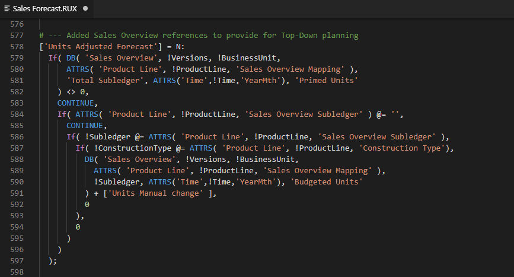
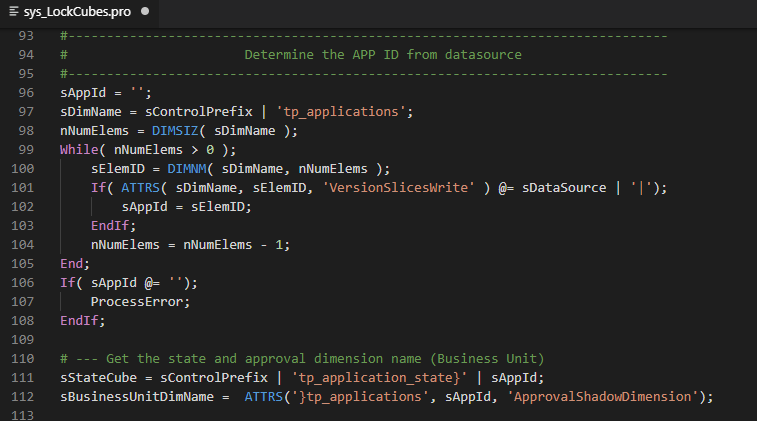
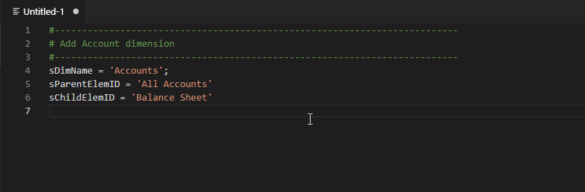
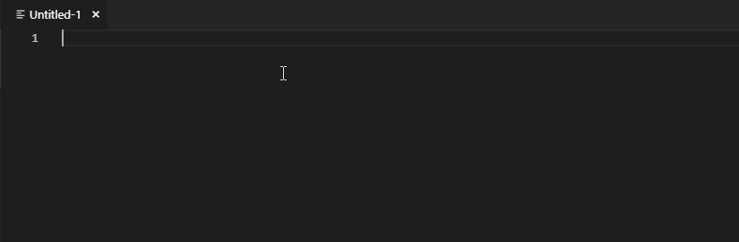
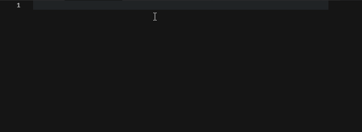
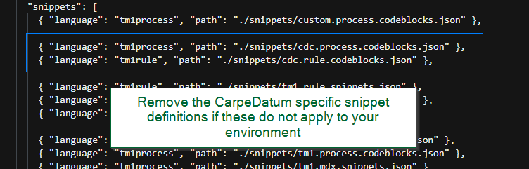

# TM1 Helper: Syntax Highlighting & Snippets

TM1 Syntax Highlighting and Snippets extension is a set of syntax highlighting files, code completions and snippets for developing rules and Turbo Integrator processes in IBM Planning Analytics/IBM Cognos TM1 server either local or on the IBM Cloud.


### About CarpeDatum
[CarpeDatum](https://www.CarpeDatumInc.com) provides planning and analytics consulting and product development services for IBM, Microsoft, Tableau, and Qlik since 1997.   Our highly skilled consultants have years of *real-world* experience in financial analysis, business intelligence, performance management and information systems.  We apply this unique blend of knowledge and skill to deliver powerful value-added applications to help organizations achieve strategic and tactical goals. 

### Check out other TM1 products:
* [TM1Compare](http://www.TM1Compare.com) for rapidly analyzing differences in a multi server environment and migrating those changes between servers
* [TM1Connect](http://www.TM1Connect.com) enables direct live ODBC access to TM1 cube data from standard relationally aware tools such as Tableau, Qlik, PowerBI, MicroStrategy, etc.

## Release 1.0.2

* Updated all rule and process functions to include the full set of Planning Analytics functions.
* Fixed a compatibility issue with the CDC Dark theme in the new versions of VSCode
* Moved Set View Datasource to generic TM1 Process Codeblocks   (thanks A. Sutcliffe!)

## Features

* [Syntax Highlighting](#syntax-highlighting) for all rules and process functions to allow for faster readability
* [Code Completion](#code-completion) to assist with parameter usage in the rule and process function calls
* [TI Snippets](#code-snippets) for standard approaches to common operations in a TM1 Turbo Integrator Process, such as subset element looping, datasource parameter setting, etc
* [MDX Query Building](#mdx-query-building) allows you to quickly generate complex MDX from building blocks of MDX statements.
* [Standardized Conventions](#standardized-conventions) are used for all variables, parameters, and code blocks that allow for consistency in code usage and readability
* [CarpeDatum Snippets](#cdc-snippets) are included in this repository for those customers using CarpeDatum's Turbo Integrator script library
* [Custom Snippets](#custom-snippets) can be added for personalized and frequently used snippets for rules and TI processes

>NOTE: The snippets and code completion includes syntax and functional capabilities up to version 2.0.6 (such as hierarchies, temporary views, etc).  Some commands and code snippets may not be available on older versions of TM1.

>**IMPORTANT**: IBM Planning Analytics/Cognos TM1 does not allow for direct editing of the .RUX and .PRO files.   All editing must be done by copying the appropriate text from the standard TM1 interfaces and pasted into VSCode.   Editing can take place there, and once changes are completed, pasted back into the standard interface (such as Process Editor or Rules Editor)


## Installation

### Using VSCode

* Search for TM1 in your Visual Studio Code extensions click `install`

### Using GIT

* Open a command-line window and navigate to the directory where VSCode extensions are installed.   On windows, this directory is usually `C:\users\{username}\.vscode\extensions`

* Clone this repository into this directory with the command:
```
      git clone https://github.com/CarpeDatumInc/vscode-tm1.git tm1
```

# Features

## <a name="user-content-syntax-highlighting" id="syntax-highlighting">Syntax Highlighting</a>

Syntax highlighting is available on rules and Turbo Integrator processes

### Rule Syntax Highlighting



### Turbo Integrator Syntax Highlighting



## <a name="user-content-code-completion" id="code-completion">Code Completion</a>

Start typing any part of a standard TM1 function and the list of matching commands along with their parameters will be displayed




## <a name="user-content-code-snippets" id="code-snippets">Turbo Integrator Code Snippets</a>

Snippets provided with this extension begin with the letter x.   Press x to see the list of code snippets available, and select the desired entry.   The code will be automatically inserted into VSCode and can be completed by pressing `TAB` through the frequently changed parameters.




## <a name="user-content-mdx-query-building" id="mdx-query-building">MDX Query Building</a>

There are two types of MDX snippets; MDX Expressions (mdx) and MDX Queries (mdq).   Using the `mdx` and `mdq` snippet prefixes, you can generate complex MDX queries from basic building blocks.




## <a name="user-content-standardized-conventions" id="standardized-conventions">Standardized Conventions</a>

### Variable Naming
All variable names are consistent throughout rules and Turbo Integrator functions and code blocks.   The following naming conventions for variables are used: 

* `p = Parameter`: Variables defined on the Parameters tab should be prefixed with a “p”.
* `v = Variables`: Variables defined on the Variables tab should be prefixed with a “v”.
* `c = Character`: Variables that contain a single character should be prefixed with a “c”.
* `n = Numeric`: Variables that contain numeric values should be prefixed with an “n”.
* `s = String`: Variables that contain string values should be prefixed with an “s”.
* `b = Boolean`: Variables that are Boolean (1 or 0) should be prefixed with a “b”.

** Special Note **
There are a number of TI and Rule functions which use the boolean indicator inconsistenly.   Some use a numeric 1 or 0 and others use a string '1' or '0'.   Where the function requires a numeric boolean value, the `b` prefix will be used.   For those few string boolean values, TM1Helper will use the convention of 'sFlag'.


### Commenting

Several standardized comment blocks are provided:

* `xHeader` snippet provides the introduction to the Turbo Integrator script, description of operation, dependencies as well as change control sections.
* `xLarge Code Block` snippet introduces major sections of a Turbo Integrator or rule block.
* `xMedium Code Block` snippet introduces minor breakouts of a Turbo Integrator or rule block within a major section.


## <a name="user-content-cdc-snippets" id="cdc-snippets">CarpeDatum Library Snippets</a>

CarpeDatum snippets provide code snippets for CarpeDatum customers leveraging our standard script library.   It works much in the same as standard snippets except these are not part of the standard TM1 functions or operations.

You can disable these from the snippet lookup by removing the entry in the package.json file or remove the source files where these are located.




## <a name="user-content-custom-snippets" id="custom-snippets">Custom Snippets</a>

We have provided a reference for your own custom Turbo Integrator code snippets by simply creating a file named `custom.process.codeblocks.json` in this extensions directory.    

It is recommended that you do not update the `tm1.*` files as they will change with subsequent releases.   Place all of your personal snippets in `custom.*` and these will remain unchanged as you update new releases of this extension.

## License

TM1 Helper is [MIT Licensed](LICENSE.md)

## Contact us!
We would love to hear from you!   Let us know if you would like to incorporate some new snippets, have some syntax changes or additions, or if you find any errors with the ones included in this extension.

* [Contact Support](mailto:support@CarpeDatumInc.com)
* [Visit our Website](https://www.CarpeDatumInc.com)

**Enjoy!**